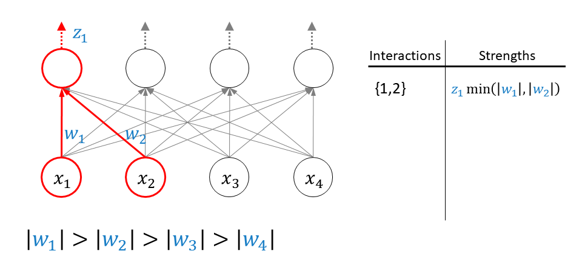

# Neural Interaction Detection (NID)





[M. Tsang](http://www-scf.usc.edu/~tsangm/), [D. Cheng](http://www-scf.usc.edu/~dehuache/), [Y. Liu](http://www-bcf.usc.edu/~liu32/). Detecting Statistical Interactions from Neural Network Weights, ICLR 2018. [[pdf]](https://openreview.net/pdf?id=ByOfBggRZ)


## Usage


- Run the demo at "demo.ipynb"
	* the demo trains a multilayer perceptron (MLP) on synthetic data containing interactions with nonlinearities. at the end of the notebook the interactions are found by decoding the learned weights 
- requires python 3.6+ and jupyter notebook, tested with pytorch 1.3.1, scikit-learn 0.21.3, numpy 1.17.1


## Reference
If you use NID in your research, please cite the following:

```
@article{tsang2017detecting,
  title={Detecting statistical interactions from neural network weights},
  author={Tsang, Michael and Cheng, Dehua and Liu, Yan},
  journal={arXiv preprint arXiv:1705.04977},
  year={2017}
}
```

